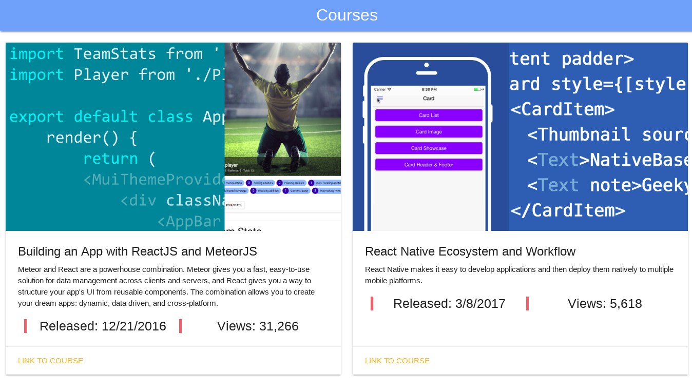

# React Testing and Debugging #

Test React code with Jest, debug with Chrome, check type with flow, and optimize your code with ESLint

- Course on [LinkedIn][1] by [Emmanuel Henri][2]

Author: [Francis Rodrigues][3]

## Create React App ##

This project was bootstrapped with [Create React App][4].

## Screenshot ##

## References ##

- Create React App on [Github][4]
- [ESLint User Guide][5] - The pluggable linting utility for JavaScript and JSX
- [Airbnb Javascript Style Guide][6]
- [Airbnb React/JSX Style Guide][7]
- [Flow - A Static Type Checker for JavaScript][8]
- [Jest - Painless Javascript Testing][9]

  [1]: https://www.linkedin.com/learning/react-testing-and-debugging
  [2]: https://www.linkedin.com/learning/instructors/emmanuel-henri
  [3]: https://github.com/francisrod01
  [4]: https://github.com/facebookincubator/create-react-app
  [5]: https://eslint.org/docs/user-guide/
  [6]: https://github.com/airbnb/javascript
  [7]: https://github.com/airbnb/javascript/tree/master/react
  [8]: https://flow.org
  [9]: https://jest-bot.github.io/jest/

## License ##

MIT
